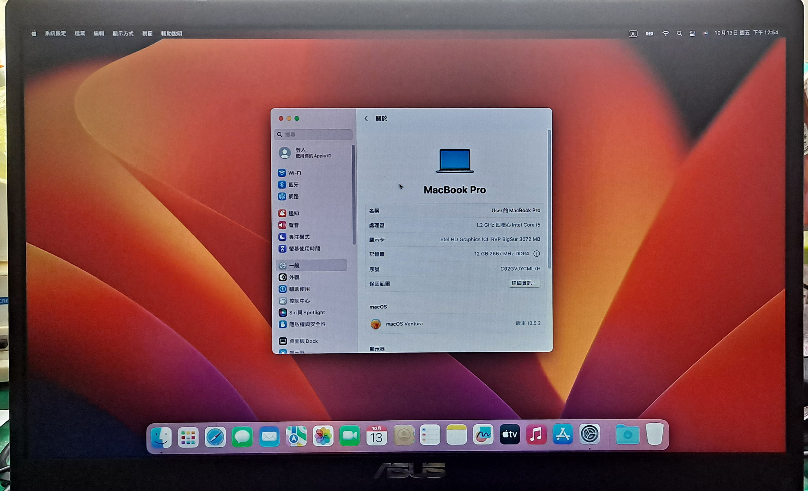

# ASUS-Laptop-X509JP-icelake-Hackintosh

## 🖥️Device
| Model | ASUS Laptop X509JP |
|------------|-------------------------------|
| CPU | i5 1035G1(ice lake) |
| GPU | Intel UHD Garphics |
| RAM | 12GB |
| Audio | Realtek ALC256 |
| WIFI／Bluetooth | Intel Wireless AC 9461 - Wi-Fi 5(802.11ac) |
| BIOS Version | 307 |

## 📀System
OS：MacOS Monterey

SMBIOS：MacBookPro16,2

OC：0.7.7

## 🛠️Setting BIOS
Advanced > Intel AES-NI：Disable

Advanced > SATA Configuration > SATA Mode Selection：AHCI

Boot > Fast Boot：Disable

Security > Secure Boot > Secure Boot Control：Disable

- CFG Lock：Disable,You need to use ControlMsrE2.efi or CFGLock.efi

                <key>Tools</key>
                <array>
                        <dict>
                                <key>Arguments</key>
                                <string>unlock</string>
                                <key>Auxiliary</key>
                                <true/>
                                <key>Comment</key>
                                <string></string>
                                <key>Enabled</key>
                                <true/>
                                <key>Name</key>
                                <string>ControlMsrE2</string>
                                <key>Path</key>
                                <string>ControlMsrE2.efi</string>
                                <key>RealPath</key>
                                <false/>
                                <key>TextMode</key>
                                <false/>
                        </dict>
                </array>
## 💡Device status
### Works：
- [x] Graphics
- [x] USB
- [x] Webcam
- [x] Brightness controls
- [x] Battery percentage
- [x] Sleep
- [x] TouchPad
- [x] WiFi
- [x] Speakers
- [x] Microphone
- [x] Bluetooth
### Notice!：
Do not reboot after entering the Windows dual system, must shut down! Speakers will not work !
